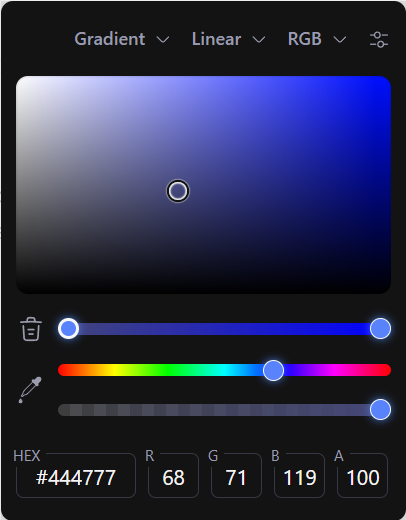

# Color Picker Chrome Extension

一个功能强大的 Chrome 扩展，基于vue3-color-picker实现，用于从网页中拾取颜色。

## 功能特点

- 🎨 使用原生 EyeDropper API 进行颜色拾取
- ⌨️ 快捷键支持 (Alt+Q) 快速激活拾色器
- 🌈 支持多种颜色格式：HEX, RGB, HSL, HSV
- 🌙 深色/浅色主题支持
- 🖱️ 直观的图形界面

## 安装说明

1. 下载扩展文件或从 Chrome Web Store 安装
2. 打开 Chrome 浏览器，进入 `chrome://extensions/`
3. 启用"开发者模式"
4. 点击"加载已解压的扩展程序"
5. 选择扩展文件夹

## 使用方法

### 快捷键激活
- 按下 `Alt + Q` (Windows/Linux) 或 `Cmd + Shift + X` (Mac) 激活拾色器
- 在任何网页上点击要拾取的颜色

### Popup 激活
- 点击浏览器工具栏中的扩展图标
- 使用内置的颜色选择器

## 颜色格式支持

扩展支持以下颜色格式：

1. **HEX** - 十六进制颜色值 (#FF5733)
2. **RGB** - 红绿蓝值 (rgb(255, 87, 51))
3. **HSL** - 色相、饱和度、亮度 (hsl(16, 100%, 60%))
4. **HSV** - 色相、饱和度、明度 (hsv(16, 80%, 100%))

## 权限说明

该扩展需要以下权限：

- `scripting` - 在网页上执行脚本以激活拾色器
- `tabs` - 访问当前标签页信息
- `storage` - 保存最后拾取的颜色
- [commands] - 注册和监听快捷键
- `activeTab` - 访问当前活动标签页

### 注意使用限制
某些页面出于安全限制无法使用拾色器功能：
- Chrome 内部页面 (`chrome://*`)
- 扩展商店页面 (`chrome.google.com/webstore/*`)
- 新标签页 (`chrome://newtab`)
- 其他受保护的系统页面

## 故障排除

### 快捷键不工作
1. 检查快捷键是否被其他程序占用
2. 在 `chrome://extensions/shortcuts` 中修改快捷键设置
3. 确保当前页面允许扩展运行

### 某些页面无法使用
由于浏览器安全限制，以下页面无法使用拾色器功能：
- Chrome 内部页面 (`chrome://*`)
- 扩展商店和受保护页面
- 新标签页和其他系统页面

### 颜色未正确显示
1. 确保网页完全加载后再使用拾色器
2. 某些 CSS 效果可能影响颜色拾取准确性

## 开发信息

- 使用 Vue 3 + TypeScript 构建
- 基于 EyeDropper API 实现颜色拾取
- 支持 Manifest V3 规范
- 使用 Vite 和 CRXJS 进行构建

## 更新日志

### v1.0.0
- 初始版本发布
- 基本颜色拾取功能
- 快捷键支持
- 多种颜色格式显示

---

*注意：此扩展仅在 HTTPS 和 HTTP 页面上工作，在 Chrome 内部页面和受保护页面上无法使用。*